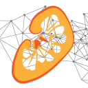

# Renal Segmentor

An application to segment kidneys from renal MRI data using a convolutional neural network (CNN).

<h2 align="center"></h2>

## Using the segmentor from an executable

1. Download the [latest release](https://github.com/alexdaniel654/Renal_Segmentor/releases/download/latest/renal_segmentor.exe)
2. Double click `renal_segmentor.exe`. The GUI takes quite a long time to load (~30 sec) and doesn't have a splash screen so be patient.
3. Once the GUI has loaded, click `Browse` and select the raw data you want to segment. Supported file types are `.PAR/.REC`, `.nii`, `.nii.gz` and `.img/.hdr`, other file types supported by [nibable](https://nipy.org/nibabel/api.html#file-formats) may work but are untested.
4. If you want the mask to be just 0s and 1s tick the `binary` check box, if you want the CNNs probability that the voxel is a kidney, leave it unchecked.
5. Tick the `raw` checkbox if you want the raw image data to be saved as a `.nii.gz` file in the same location as the mask (can be useful if you're using `.PAR/REC` as your input).
6. By default the segmentor outputs the mask as a `.nii.gz` file in the same folder as the raw data e.g. if the raw checkbox was ticked, after running the programme the folder with raw data `./sub_01/T2W_volume.PAR` would also have `./sub_01/T2W_volume.nii.gz` and `./sub_01/T2W_volume_mask.nii.gz` in it. If you want the mask to be output somewhere different click `Browse` and navigate to the folder you want to save the data in then give the mask a name.
7. Click start.
8. The application will run and a few seconds later a box will appear saying the program completed successfully. 
9. If you want to segment some more data click the `edit` button on the bottom of the finished screen, if you're done, click `close`.

## How it works

The methods used by this software are currently in press. Once they've been published links will be added here to the software and data used to train the network.

## Contributing

Feel free to open a pull request if you have a feature you want to develop or [drop me an email](mailto:alexander.daniel@nottingham.ac.uk) to discuss things further. Some initial areas that would make a good first project are making the GUI able to select and process multiple files at once and upgrading to tensorflow v2.x.
