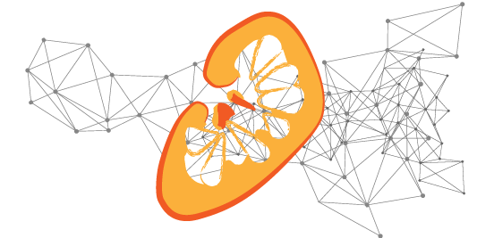

# Renal Segmentor

An application to segment kidneys from renal MRI data using a convolutional neural network (CNN).

<h2 align="center"></h2>

## Using the segmentor from an executable
### As a Graphical User Interface (GUI)

1. Download the [latest release](https://github.com/alexdaniel654/Renal_Segmentor/releases/download/latest/renal_segmentor.exe)
2. Double click `renal_segmentor.exe`. The GUI takes quite a long time to load (~30 sec) and doesn't have a splash screen so be patient.
3. Once the GUI has loaded, click `Browse` and select the raw data you want to segment. Supported file types are `.PAR/.REC`, `.nii`, `.nii.gz` and `.img/.hdr`, other file types supported by [nibable](https://nipy.org/nibabel/api.html#file-formats) may work but are untested.
4. If you want the mask to be just 0s and 1s tick the `binary` check box, if you want the CNNs probability that the voxel is a kidney, leave it unchecked.
5. Post-processing is applied by default. This discards all but the two largest connected regions in the mask in theory retaining only the two kidneys and removing any erroneous unconnected regions. It should be noted that because post-processing keeps only two regions, care should be taken if using this application with transplant patients as they may have three kidneys. To disabel post-processing, untick the box.
6. Tick the `raw` checkbox if you want the raw image data to be saved as a `.nii.gz` file in the same location as the mask (can be useful if you're using `.PAR/REC` as your input).
7. By default the segmentor outputs the mask as a `.nii.gz` file in the same folder as the raw data e.g. if the raw checkbox was ticked, after running the programme the folder with raw data `./sub_01/T2W_volume.PAR` would also have `./sub_01/T2W_volume.nii.gz` and `./sub_01/T2W_volume_mask.nii.gz` in it. If you want the mask to be output somewhere different click `Browse` and navigate to the folder you want to save the data in then give the mask a name.
8. Click start.
9. The application will run and a few seconds later a box will appear saying the program completed successfully. 
10. If you want to segment some more data click the `edit` button on the bottom of the finished screen, if you're done, click `close`.

### Via a Command Line Interface (CLI)
1. Download the [latest release](https://github.com/alexdaniel654/Renal_Segmentor/releases/download/latest/renal_segmentor.exe)
2. Run the `renal_segmentor.exe -h` to generate a list of available parameters. The application runs via a command line if any input arguments are specified, if not, it opens as a GUI.

## Citing Renal Segmentor
If you have made use of renal segmentor for your work, please cite Daniel AJ, _et al_. Automated renal segmentation in healthy and chronic kidney disease subjects using a convolutional neural network. Magnetic Resonance in Medicine 2021;86:1125–1136 doi: [https://doi.org/10.1002/mrm.28768](https://doi.org/10.1002/mrm.28768). Alternatively if you wish to cite a specific software version, each release has an individual DOI on Zenodo, the DOI for the latest release can be [found here](https://doi.org/10.5281/zenodo.4068850).

## How it works

The methods used in this software are outlined in Daniel AJ, _et al_. Automated renal segmentation in healthy and chronic kidney disease subjects using a convolutional neural network. Magnetic Resonance in Medicine 2021;86:1125–1136 doi: [https://doi.org/10.1002/mrm.28768](https://doi.org/10.1002/mrm.28768).

The dataset used to train this network is freely available on Zenodo, doi: [https://doi.org/10.5281/zenodo.5153567](https://doi.org/10.5281/zenodo.5153567).

## Contributing

Feel free to open a pull request if you have a feature you want to develop or [drop me an email](mailto:alexander.daniel@nottingham.ac.uk) to discuss things further.
